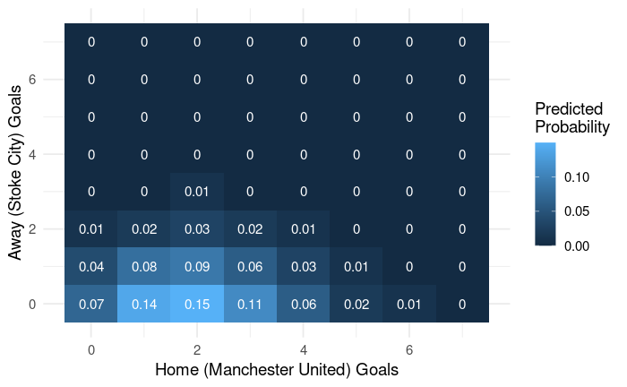

```{r setup, echo=FALSE}
library(dplyr)
library(ggplot2)
theme_set(theme_minimal(base_size = 14))
```

## The Goal


## Part One

### Fundamentals

#### R vs RStudio vs RStudio Cloud

_Live explanation_

[R](https://www.r-project.org/)
[RStudio](https://rstudio.com/)
[RStudio Cloud](https://rstudio.cloud/)

#### Opening a Notebook

From the RStudio cloud dashboard, select the "New Project" dropdown and select "New Project from Git Repository". Copy in the workshop repository link:

[https://github.com/warwickdatascience/football-workshop](https://github.com/warwickdatascience/football-workshop)

Once the project has loaded, type `renv::restore()` in the `Console` pane to install all required _packages_.

You can open a notebook by opening the `notebooks` folder in the `Files` pane and selecting the desired notebook. Notebooks end in `.Rmd`. These can then be converted to `.html` files (web pages) which are used for the web version of this repository (i.e. RStudio cannot open them).

#### Running Code

An R notebook is made up of code _chunks_ interlaced with text. You can create a code chunk in RStudio by using `Insert > R` in the top bar of the notebook pane. A shortcut for this is `ctrl+shift+I`.

You can then enter code into a chunk. For example, use print("Hello, World!") to say hello.

Finally, you can run code by pressing the play button at the top right of a cell (or use `ctrl+shift+enter`). If you want to stop code before it completes, press the stop button.

Note: R generally doesn't care about spaces, new lines, or identation.

Lines beginning with # are not run. These are called comments.

You will find TODOs followed by "_______"s. These are for you to fill in during the breakout sessions.

There are also a few CKPTs. These are optional checkpoint tasks that don't appear in the final notebook. Complete these to help understand what your data looks like at any point.

#### Imports

_Live explanation_

[CRAN](https://cran.r-project.org/)

#### Variables

Variables are a way of given R memory. The format for assigning a value to a variable is:

```{r eval=FALSE}
variable_name <- value
```

Note, the variable names cannot contain spaces; instead, we use underscores, periods, or hyphens. Once a variable has been assigned a value, whenever R sees it in the future, it will replace it with the value it was last set to.

```{r}
players <- 11
```

```{r}
print(players)
```

```{r}
players <- 10
```

```{r}
print(players)
```

Be careful! RStudio lets you run cells out of order. It is advised to run things from top to bottom only to avoid confusion. To run multiple cells, look in the `Run` dropdown above the notebook pane.

High-level parameters that do not change during the script are often denoted with all-caps.

#### Variable Types

If you want to pass text data to R, you need to explicitly use single or double quotes (they mean the same) to let R know that you intended to input text and not a variable.

```{r}
greeting <- 'Hello'
print(greeting)
```

```{r}
greeting <- "Hello"
print(greeting)
```

```{r}
greeting <- Hello
```

#### Functions

You use functions to get R to do something. They have a common syntax:

```{r eval=FALSE}
function_name(input1, input2, ...)
```

Some functions return a value, in which case we can assign this to a variable.

```{r eval=FALSE}
variable <- function_name(input1, input2, ...)
```

Some inputs have names, in which case we use this syntax.

```{r eval=FALSE}
function_name(input1, named_input = input2)
```

#### Dataframes

Dataframes are essential part of the R language. Tibbles are a type of dataframe that print out in a prettier way. There are many ways we can glean more information about a dataframe:

- `head(df)`: first few rows
- `tail(df)`: last few rows
- `nrow(df)`/`ncol(df)`: number of rows/columns
- `str`: structure of the dataframe
- `summary(df)`: numeric summaries of the columns
- `names(df)`: column names

We can read in a dataframe from a CSV file using `read.csv(...)`. Putting this inside of `tibble(...)` will give us a tibble (and the prettier printing that comes with it).

### The Tidyverse

The tidyverse is a collection of packages in R, used for data science and analysis, that work extremely well together. They share a common philosophy of data which is intuitive yet powerful.

#### Data Manipulation

Data manipulation with the tidyverse is performed using a package called `dplyr`. This has 5 key commands (known as the `dplyr` verbs). These are incredibly flexible and powerful, yet we will focus on some basic uses.

```{r}
# Use select() to keep only certain columns
select(mpg, hwy, cty)
```

```{r}
# select() can also rename columns
select(mpg, highway = hwy, city = cty, class)
```

```{r}
# Use mutate to create a new column based on an existing column
mutate(presidential, term_length = end - start)
```

```{r}
# Mutate can also be used to create a new column with a single value
mutate(presidential, title = "President")
```

#### Piping

The tidyverse is tied together by an operator known as the pipe, `%>%`. This takes the output of one function and passes it as the input to the next. This allows us to create chains of functions (pipelines) to perform multiple processing steps on our data. An example of this is shown below (don't worry about the exact details; the flow of data is what matters).

```{r}
mpg %>%
  filter(year == 1999) %>%
  mutate(hwy_km_g = hwy * 1.61) %>%
  group_by(class) %>%
  summarise(avg_hwy_km_g = mean(hwy_km_g), .groups = 'drop')
```

We see here an example of the `summarise()` function which we use to collapse down a dataframe into one value per group. This will be used in the template but examples will be given.

#### `ggplot2`

Visualisation in the tidyverse is handled by `ggplot2`. The `gg` in the name stands for layered grammar of graphics. This is how we build a ggplot, by stacking layers (starting with a base, then e.g. a geometry, then a scale, then labels, then theming, etc.) separated by `+`s. 

The most peculiar of these is the geometry. This controls what shapes are used to represent data (e.g. points, lines, bars). Geometries are always in the form `geom_<shape>`. For example, `geom_line` and `geom_text`. Any visual aspect of a geometry is called an aesthetic (e.g. x/y position, colour, size, transparency, shape).

We control which variables in our dataset map to the which aesthetics using the `aes()` function. Aesthetics set in the base layer apply to all geometries. Here is a comprehensive example (comment out lines to see what each bit does). We can also manually set aesthetics outside of `aes()`.

```{r}
mpg %>%
  ggplot(aes(x = hwy, y = cty)) +
    geom_point(aes(size = displ)) +
    geom_smooth(colour = 'red', method = 'lm') +
    labs(x = "Highway Mileage", y = "City Mileage", size = "Engine Size") +
    theme(panel.grid = element_line(colour = 'darkblue'))
```

## Part Two

### Regression

_Live explanation_

[Linear regression](../resources/linear_regression.svg)

[Poisson distribution](../resources/poisson_pmf.svg)

[Natural logarithm](../resources/natural_log.gif)

We can fit a Poisson regression model by using the `glm` function. We pass in a formula with the variable we're trying to predict on the left of a tilde (~) and the predictors we're using on the right separated by `+`s. We set the `family` equal to `poisson(link = log)` and pass in data to train on as the `data` input. In all, this looks like this:

```{r}
df <- tribble(
  ~num_awards, ~meal_price, ~city_center,
  7,           30,          FALSE,
  8,           35,          TRUE,
  3,           24,          TRUE,
  3,           19,          FALSE
)

model <- glm(
  num_awards ~ meal_price + city_center,
  family = poisson(link = log),
  data = df
)
```

A summary of the model can be extracted with `summary(model)`. The most accessible output is the `Estimate` column of the `Coefficients` table. If we raise this number to the power $e$ using `exp(...)`, this tells us how a change of one unit of that variable impacts the outcome on average.

It is often desirable to remove the intercept term when using a predictor with multiple levels (e.g. football teams). To this we add `+ 0` to the end of our formula.

_Live explanation_

### Evaluating Errors

To evaluate the performance of our model we need to split our available data into a training and testing set. This stops us from simply learning the data rather than properly modeling it. We fit our model to the training data and then predict on the test dataset.

To do this we use the `predict` function, passing in our model, new data, and setting `type = response`. We then round the results to get whole number responses.

We measure our models performance by taking the errors of our model, squaring them, taking the average over all test cases, and finally taking the square root of the result. This is known as the root mean squared error (RMSE). The use of squaring pushes extreme errors more than mild errors, which is often desirable.

### Prediction

Finally, we would like to predict the outcome of a hypothetical game. We do this by predicting the mean goal rate for two teams (one home, one away) and using these as the rate parameters of a Poisson distribution. We can then use the `dpois` function to give the chance of a certain goal count occurring. We do this for many combinations of scores to generate a table of possible scores and predicted likelihoods of such scores occurring. It is then up to you to use this to build the final visualisation!

### Next Steps

- More years, more leagues
- Are teams improving/regressing over time?
- Is the home advantage greater for certain teams?
- How does team composition affect the score?

## Wrapping Up

Follow WDSS on [Facebook](https://www.facebook.com/warwickdatasciencesociety), [LinkedIn](https://www.linkedin.com/company/warwickdatasciencesociety/), [Instagram](https://www.instagram.com/warwickdatasciencesociety/).

Join our [community group](https://www.facebook.com/groups/wdss.community).

[Subject examples](https://github.com/warwickdatascience/subject-examples/tree/master/python) and [research blog](http://research.wdss.io/).

Know a graphic designer? [Ignore the deadline](https://recruitment.warwickdatascience.com/wdss-graphic-designer).
